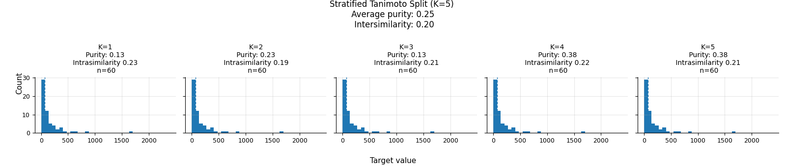

# stratified-tanimoto-split


### Example of usage

```python
    #Create dataset
    train_dataset = PolarisDataset(root="./dataset", task="MLM", train=True, force_reload=False)
    
    # Instantiate the STS class
    ## Params: 
    ## - Dataset should contain the ecfp field
    ## - k = number of splits in the (k-fold-cross validation like)
    ## - split_size is the size of the val set in percentage
    sts = StratifiedTanimotoSplit(train_dataset, K=5, split_size=0.2)
    
    ## Reference Regression Target
    target_values = [d.y[0] for d in train_dataset]
    target_values = torch.tensor(target_values)
    ## splits is a list of tuple, every tuple is in the form (training_set_indeces, val_set_indeces)
    splits = sts.split(target_values)
```

### Notes
- Possible overlaps between validation sets
- Every validation sets have the same size


